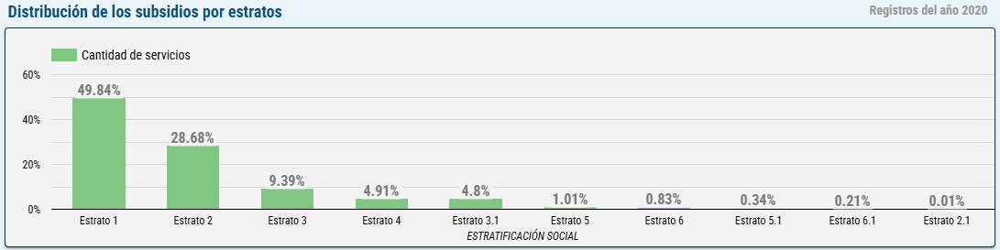
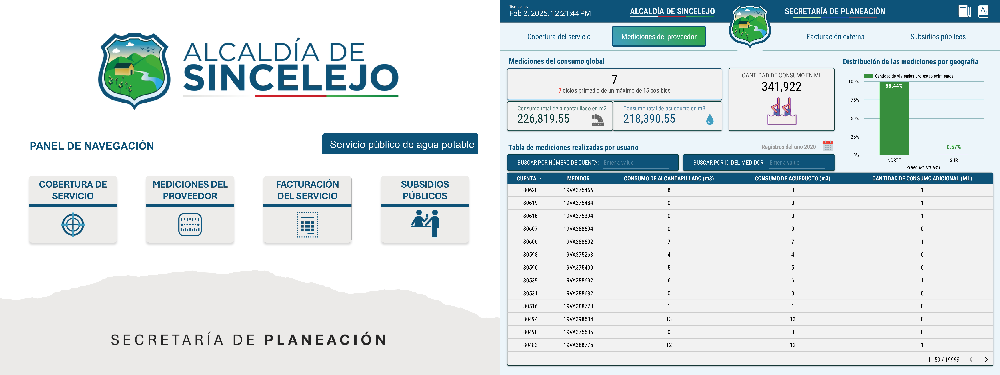
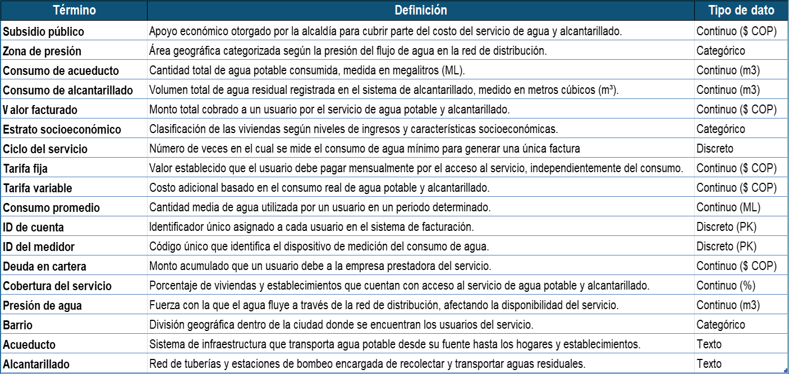

# Informe Visual y Tablero de Análisis de Subsidios, Consumo y Facturación del Servicio de Agua en Sincelejo (2020).

## Resumen

El objetivo de este proyecto fue diseñar e implementar un informe visual para analizar la cobertura, consumo, facturación y subsidios del servicio de agua potable y alcantarillado en Sincelejo durante el año 2020. Para ello, se desarrolló un tablero de control estático en Looker Studio, basado en datos públicos proporcionados por la Secretaría de Planeación de la Alcaldía Municipal.

El conjunto de datos utilizado contiene información detallada sobre los servicios contratados, las mediciones del consumo de agua, los valores facturados a los usuarios y el respaldo económico otorgado por la alcaldía mediante subsidios. Dado que la base de datos solo abarca el año 2020, el tablero se diseñó como un informe estático sin análisis temporal dinámico.

El tablero diseñado en este proyecto facilita la visualización de patrones clave en el acceso y uso del servicio, permitiendo identificar la distribución del consumo según zonas geográficas, la proporción de usuarios con servicio activo o inactivo, así como el impacto de los subsidios según estratos socioeconómicos. Entre los principales hallazgos se destaca que la mayoría de los subsidios se concentran en los estratos más bajos, asegurando acceso al servicio a poblaciones vulnerables, mientras que el consumo de agua presenta variaciones significativas entre distintas zonas de la ciudad. Este informe visual proporciona una herramienta de análisis accesible y estructurada para evaluar la eficiencia en la distribución de los recursos y el impacto del subsidio en la comunidad, contribuyendo a una mejor toma de decisiones en la gestión del servicio de agua potable y alcantarillado.

## Entendimiento de la problemática del negocio

La Secretaría de Planeación de la Alcaldía Municipal de Sincelejo, como entidad responsable de la gestión de subsidios para el servicio de agua potable y alcantarillado, dispone de datos públicos sobre la cobertura del servicio, consumo de agua, facturación y apoyo financiero otorgado a los usuarios. Esta información, publicada dentro del marco de transparencia y acceso a datos abiertos, constituye la base de este proyecto.

El análisis busca comprender la distribución de los subsidios, la relación entre consumo y facturación, así como el impacto del respaldo económico en los distintos estratos socioeconómicos de la ciudad. A través del tablero de control visual, se facilita la identificación de patrones clave en el uso del servicio y la eficiencia en la asignación de los subsidios, proporcionando información relevante para la toma de decisiones en la planeación y sostenibilidad del sistema de agua en Sincelejo.

## Entendimiento de los datos

El conjunto de datos proporcionado para acceso público contiene registros detallados sobre los subsidios otorgados al servicio de agua potable y alcantarillado en Sincelejo durante el año 2020, que esta comprendido por 19.999 registros y 33 campos (características). Estos campos recopilan información de identificación única de viviendas y establecimientos beneficiados, con variables clave como el tipo de servicio contratado (acueducto y/o alcantarillado), la zona de presión del suministro, el estado del servicio (activo o inactivo), el estrato socioeconómico del usuario, el consumo medido en metros cúbicos, el valor facturado, el monto subsidiado y el porcentaje de cobertura del subsidio según el consumo.

La Figura 1 muestra la distribución de los registros del año 2020 en función de la estratificación social.

**Figura 1. Distribución de los registros por estratos socioecnómicos**

    

Se observa que la mayor parte de los subsidios se concentran en los estratos más bajos, con un 49.84% en el estrato 1 y un 28.68% en el estrato 2. A medida que aumenta el nivel socioeconómico, la proporción de subsidios disminuye significativamente, con menos del 1% en los estratos 5 y 6. Esto indica que el programa de subsidios está focalizado en los sectores más vulnerables, alineándose con políticas de equidad social para garantizar el acceso a los servicios básicos a quienes más lo necesitan.

####

***NOTA:*** Como parte de la preparación de datos, se eliminaron columnas innecesarias, se verificaron valores nulos y registros duplicados y se realizó un formateo de algunas variables al tipo de dato correcto.

## Resultados del producto visual

El tablero de informe desarrollado en Looker Studio fue diseñado para ofrecer una visualización clara y estructurada de la información sobre subsidios, consumo y facturación del servicio de agua potable y alcantarillado en Sincelejo. Su estructura se divide en cuatro secciones principales: cobertura del servicio, mediciones del proveedor, facturación externa y subsidios públicos, permitiendo un análisis detallado de cada aspecto relevante. A continuación en la Figura 2 se muestra una captura estática de las secciones del tablero.

**Figura 2. Imágen del producto visual**

    

El diseño del tablero facilita la interpretación de los datos a través de gráficos, tablas y métricas clave, organizadas de manera intuitiva. Esto permite identificar patrones de consumo, distribución geográfica de los servicios, comportamiento de la facturación y el impacto de los subsidios según los diferentes estratos socioeconómicos. El impacto del tablero radica en su capacidad para brindar información clara y accesible a los actores involucrados en la gestión del servicio, mejorando la toma de decisiones sobre la asignación de subsidios y la sostenibilidad del sistema de agua potable en la ciudad.

####

Para garantizar una adecuada interpretación del tablero, se elaboró una tabla con términos y definiciones clave relacionadas con la cobertura del servicio, consumo, facturación y subsidios. Esta tabla explica conceptos como los tipos de servicio contratados, las unidades de medición del consumo, la estructura de facturación y los criterios de asignación de subsidios.  En la Figura 3, se muestra la tabulación de los términos y definiones del contenido visual.

**Figura 3. Tabla de términos y definiciones**

    

Su importancia radica en proporcionar un marco de referencia claro para los usuarios del tablero, asegurando que los datos sean comprendidos de manera precisa y evitando posibles interpretaciones erróneas. Además, su impacto se traduce en una mejor capacidad analítica por parte de los tomadores de decisiones, al contar con definiciones estandarizadas que facilitan la evaluación del comportamiento del servicio y la distribución de los subsidios.

## Conclusión

- El desarrollo de este tablero permitió visualizar de manera efectiva la cobertura, consumo, facturación y subsidios del servicio de agua potable y alcantarillado en Sincelejo. Se logró identificar patrones clave en la distribución del servicio y el impacto de los subsidios, proporcionando información valiosa para la toma de decisiones. Sin embargo, la falta de datos actualizados y de una dimensión temporal limitó la posibilidad de realizar un análisis dinámico a lo largo del tiempo.

- Para futuros proyectos de análisis de datos, se recomienda actualizar el conjunto de datos con información de años posteriores, permitiendo una evaluación comparativa y la identificación de tendencias en el consumo y asignación de subsidios. También sería útil incorporar nuevas métricas que midan la eficiencia en la entrega de subsidios y su impacto en la sostenibilidad del servicio.

- En cuanto a la mejora del producto visual, se sugiere la implementación de filtros interactivos que permitan a los usuarios explorar los datos con mayor profundidad, así como la integración de herramientas avanzadas de análisis para facilitar la predicción del consumo y la optimización de los subsidios en el futuro.
